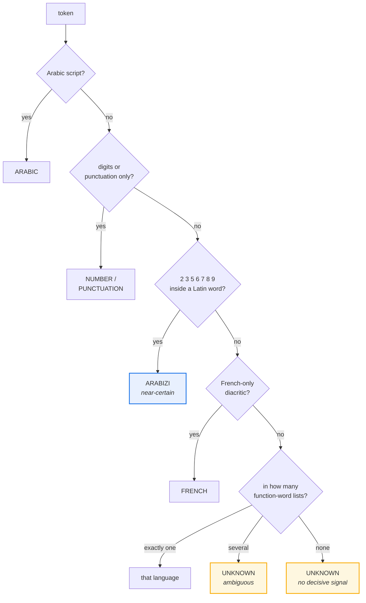

<div align="center">

# arabizi

**Moroccan Arabizi transliteration, Arabic normalization, and word-level code-switching detection.**

[](https://github.com/novagiosAI/arabizi/actions/workflows/ci.yml)
[](https://pypi.org/project/arabizi/)
[](https://pypi.org/project/arabizi/)
[](LICENSE)
[](https://peps.python.org/pep-0561/)

*No dependencies. Deterministic. Says "I don't know" when it doesn't.*

</div>

---

## Why a Moroccan one

Arabizi — Arabic typed in Latin letters — uses digits for the sounds Latin has
no letter for. Those digits are near-universal. **The letters are not.**

Moroccan arabizi is built on *French* orthography, because that is the second
language its writers were schooled in. Levantine and Gulf arabizi are built on
English:

| sound | Moroccan | Levantine / Gulf |
|---|---|---|
| ش | `ch` | `sh` |
| و (long) | `ou` | `oo` / `u` |
| ق | `9` or `q` | `2` (glottal stop) |
| گ | `g` → ڭ | `g` → ج (Egypt) |

A transliterator tuned on Levantine data reads **`chkoun`** (شكون, *"who"*) with
an English `ch` and gets it wrong. Every existing package I could find is tuned
that way. This one is not.

## Installation

```bash
pip install arabizi
```

## Three things it does

### 1. Transliterate

```python
from arabizi import transliterate

transliterate("salam 3lik")  # 'سلام عليك'
transliterate("wach kayn chi 7aja")  # 'واش كاين شي حاجة'
transliterate("mabghitch")  # 'ما بغيتش'
transliterate("labas hamdullah")  # 'لاباس الحمد لله'
```

Arabizi omits short vowels, so a pure character mapping turns `salam` into
**سالام** — the `a` is a fatha, not an alef, and nothing in the input says
which. No rule recovers that. A lookup table does, for the words where it
matters: a few hundred function words and greetings cover a large share of any
Darija text, and their spellings are settled. The transliterator checks that
first and falls back to characters for everything else.

URLs, emails and `@handles` pass through untouched.

### 2. Normalize

```python
from arabizi import normalize

normalize("أَحْمَد")  # 'احمد'   — diacritics dropped, alef unified
normalize("مـــرحبا")  # 'مرحبا'  — tatweel removed
normalize("١٢٣")  # '123'    — Arabic-Indic digits converted
```

Every step is separately switchable, because the right amount of normalization
depends on the task: collapsing ta marbuta (`ة` → `ه`) helps a search index and
hurts a morphological analyser, so it is off by default.

### 3. Detect code-switching, word by word

A single Moroccan sentence routinely carries three languages. Document-level
language identification returns one label for that and is useless.

```bash
$ arabizi detect "salam, wach kayn chi rendez-vous dispo today?"
  salam        arabizi      function word
  wach         arabizi      function word
  kayn         arabizi      function word
  chi          arabizi      function word
  rendez-vous  unknown      Latin word, no decisive signal
  dispo        unknown      Latin word, no decisive signal
  today        unknown      Latin word, no decisive signal

  dominant: arabizi
  code-switched: False
```

```python
from arabizi import detect, dominant_script, is_code_switched

for token in detect("salam خويا, wach l rendez-vous dyal today?"):
    print(token.text, token.script.value, token.evidence)
```

Evidence is applied strongest-first:



## What it will not do

**It does not guess.** `salam` is Darija and `salut` is French, but `normal` is
both and `taxi` is everyone's. A Latin word with no diacritic, no arabizi digit
and no function-word entry cannot be resolved by rules, so it comes back
`UNKNOWN` with the reason attached — not a coin flip dressed up as a label.

That is a deliberate trade. Use these labels as **features for a classifier**,
not as the classifier. Every token carries its `evidence` string so a surprising
result can be traced.

Two further limits worth knowing:

- **Transliteration is lossy and not reversible.** Round-tripping will not give
  you the input back. Use it to widen recall, not as ground truth.
- **`is_code_switched` under-reports.** It only counts languages it has real
  evidence for, so a sentence whose French words are all content words reads as
  single-language. Raising recall here means adding content words, which costs
  precision — the current setting favours precision.

## Why it exists

Because Darija is badly served by general-purpose Arabic NLP, and because the
gap is specific and fixable: the conventions differ from the Levant, the
code-switching is constant, and no existing package handles either. This is the
brick the rest of that work sits on.

## Contributing

**Spelling variants are the most useful contribution.** Arabizi is not
standardised — if you write a word differently than this package expects, that
is a bug report. See [CONTRIBUTING.md](CONTRIBUTING.md).

```bash
git clone https://github.com/novagiosAI/arabizi.git
cd arabizi
python -m venv .venv && source .venv/bin/activate   # Windows: .venv\Scripts\activate
pip install -e ".[dev]"
pytest
```

## License

[Apache License 2.0](LICENSE) — free for commercial use.

---

<div align="center">

Built and maintained by **[Novagios](https://www.novagios.com)** — IT services, AI and ITSM.

</div>
